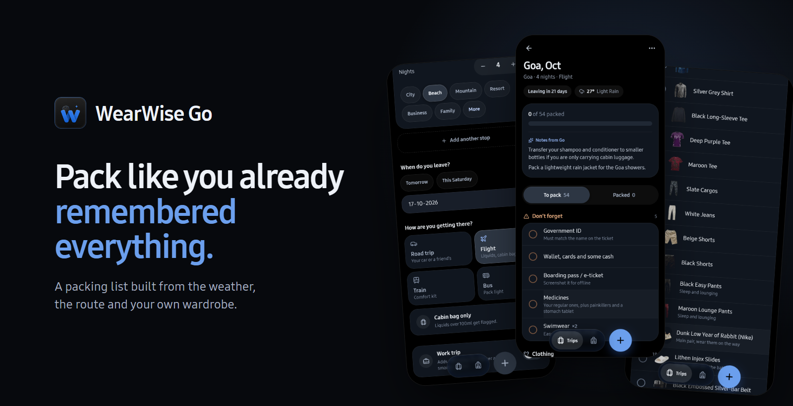
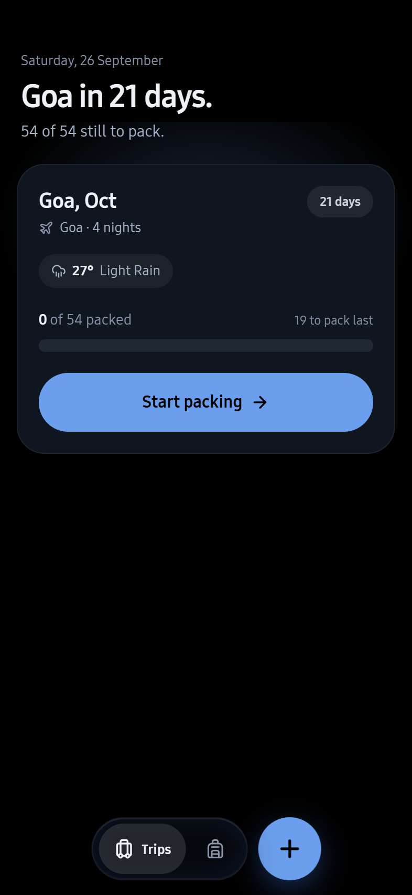
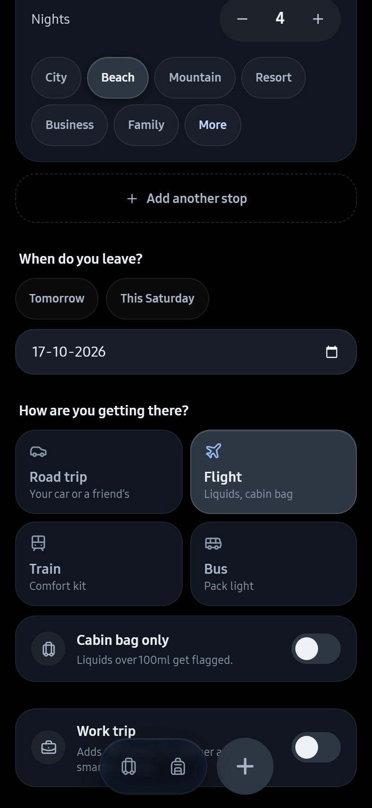
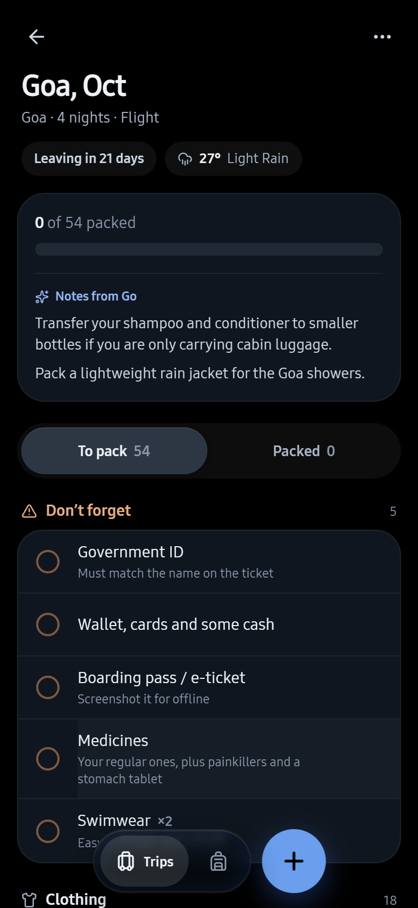
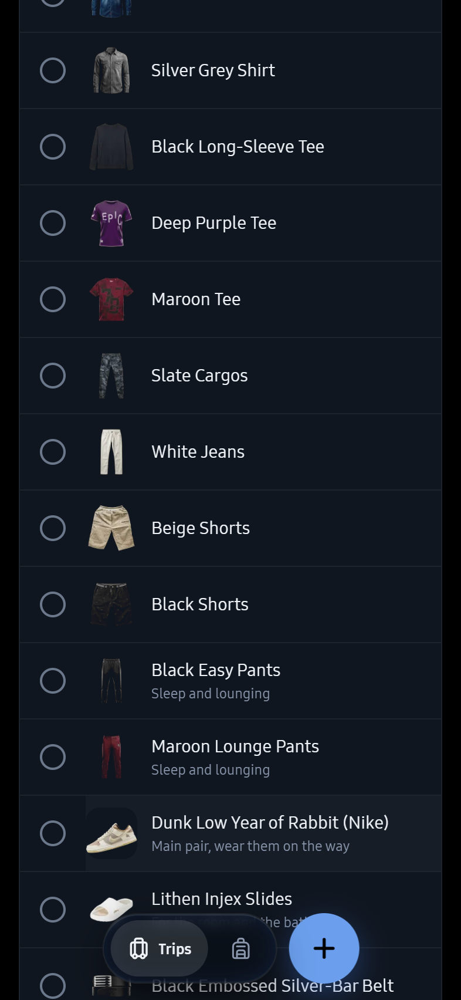
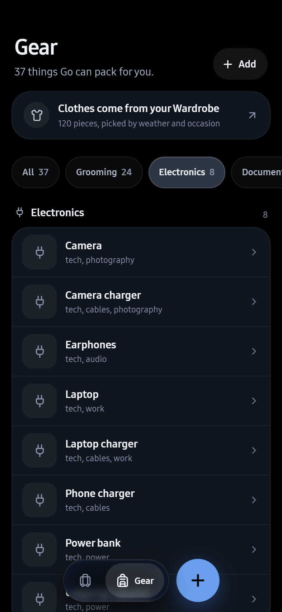
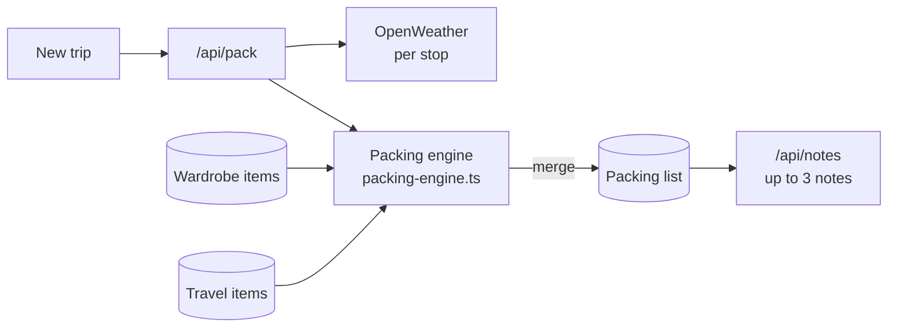

<p align="center">
  
</p>

<p align="center">
  <strong>A packing list built from the weather, the route and the clothes you actually own.</strong><br>
  Say where you are going and how, and Go writes the list, down to the smaller sunscreen that fits a cabin bag.
</p>

<p align="center">
  <a href="#features">Features</a>
  &nbsp;·&nbsp;
  <a href="#how-it-works">How it works</a>
  &nbsp;·&nbsp;
  <a href="#run-it-locally">Run it locally</a>
  &nbsp;·&nbsp;
  <a href="https://github.com/TheAlgo7/wearwise-by-algothrim">WearWise Wardrobe</a>
</p>

<p align="center">
  
  
  
  
</p>

## Why Go

Every trip starts from zero. The same mental checklist, the same things forgotten, the same over-packing, and the one item you needed still on the bathroom shelf.

Go is the travel half of [WearWise](https://github.com/TheAlgo7/wearwise-by-algothrim). It reads the same wardrobe, so a list says "Cobalt Blue Shirt" and "White Jeans", not "T-shirts x4". It checks the weather at every stop, knows a flight means a cabin bag and a road trip means the car, and keeps the list short enough to trust.

The list is built in code, the same way every time. A model only writes a few notes about it afterwards.

## Screenshots

<table>
  <tr>
    <td align="center"><br><sub>The next trip, counting down</sub></td>
    <td align="center"><br><sub>Where, when and how</sub></td>
    <td align="center"><br><sub>Weather, notes, what not to forget</sub></td>
    <td align="center"><br><sub>Real clothes from the wardrobe</sub></td>
    <td align="center"><br><sub>Everything else Go can pack</sub></td>
  </tr>
</table>

## Features

- **Your clothes, not categories.** Clothing comes from the WearWise wardrobe: the weather decides what is possible, formality decides what is right, and colour variety decides what makes the cut, so four nights is not four black tees.
- **One product per kind.** If you own two sunscreens, the smaller bottle travels. A generic "Face wash" row drops out when a real face wash exists.
- **Don't forget means it.** About five things a trip genuinely fails without, not twenty-two.
- **Pack last.** Toothbrush, charger and whatever you use that morning get their own group.
- **Right for the route.** A flight flags liquids over 100 ml and fits a cabin bag. A road trip knows the car. Passport, visa, adapter and insurance only appear when a stop is outside India.
- **Multi-stop trips.** Each stop has its own nights, its own kind of place and its own weather.
- **Rebuild without losing anything.** A rebuild merges: ticks, notes and items you added by hand stay; engine rows that no longer apply go only if they are not packed.
- **Pack it again.** Start a new trip from an old list, all unticked, or plan a past trip again with new dates.
- **Offline.** An installable PWA that keeps working without signal once a list is loaded.

## How it works



- **Deterministic first.** `buildPackingList` is a plain function of the trip, the weather, the wardrobe and the gear. The same trip always gets the same list, and the list appears as soon as the engine has built it.
- **Notes second.** `/api/notes` asks a model for at most three plain lines about the finished list, through a timed chain of Groq, Gemini and OpenRouter. If every provider fails, the list is still complete.
- **Places resolve before the weather.** A city is geocoded first, with aliases for regions (Goa becomes Panaji), so "Manali" is the hill town, not a suburb of Chennai.
- **Shared database, separate app.** Go reads the Wardrobe's `items` table and keeps its own `trips`, `packing_lists` and `travel_items`.

## Built with

| Layer | Choice |
|---|---|
| App | Next.js 16 App Router, React 19, TypeScript |
| Styling | Tailwind CSS on OKLCH tokens, shared with WearWise Wardrobe |
| Data | Supabase Postgres, the same project as the Wardrobe |
| Weather | OpenWeather current conditions and geocoding |
| Notes | Groq, Google Gemini, OpenRouter |
| Hosting | Vercel, with a daily keep-alive cron for the free database |

## Run it locally

You need Node 20 or newer and a Supabase project.

```bash
git clone https://github.com/TheAlgo7/wearwise-go-by-algothrim.git
cd wearwise-go-by-algothrim
npm install
npm run dev
```

Create `.env.local`:

```env
NEXT_PUBLIC_SUPABASE_URL=
NEXT_PUBLIC_SUPABASE_ANON_KEY=
OPENWEATHER_API_KEY=
GROQ_API_KEY=
GEMINI_API_KEY=
OPENROUTER_API_KEY=
NEXT_PUBLIC_DEFAULT_CITY=New Delhi,IN
```

Then run `supabase/schema.sql` and `supabase/seed.sql` in the Supabase SQL editor. Clothing needs the Wardrobe's `items` table in the same project.

| Command | What it does |
|---|---|
| `npm run build` | Production build |
| `npm run lint` | ESLint |
| `npm run type-check` | TypeScript, no emit |
| `python scripts/readme-shots.py` | Rebuilds the screenshots in this README from the live app, using a demo trip it deletes afterwards |

## Project structure

```text
src/
  app/            Trips, New trip, a trip and its list, Gear
  app/api/        pack, notes, weather, keepalive
  components/     destination input, packing groups, item sheets, One UI controls
  lib/            packing engine, trip timing, vehicles, weather, prompts, LLM chain
supabase/         schema and seed
scripts/          README screenshots
```

## Licence

Copyright © 2026 Gaurav Kumar, [The Algothrim](https://thealgothrim.com). All rights reserved.

The code is public to read and learn from. It is not licensed for reuse.
